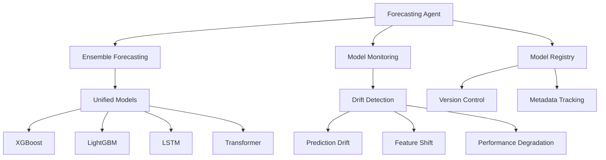
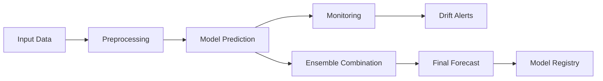

```mermaid
%% Main System Architecture
graph TD
    A[Forecasting Agent] --> B[Model Registry]
    A --> C[Ensemble Forecasting]
    A --> D[Model Monitoring]
    C --> E[Unified Models]
    D --> F[Drift Detection]
    
    B --> G[Version Control]
    B --> H[Metadata Tracking]
    
    E --> I[XGBoost]
    E --> J[LightGBM]
    E --> K[LSTM]
    E --> L[Transformer]
    
    F --> M[Prediction Drift]
    F --> N[Feature Shift]
    F --> O[Performance Degradation]
```

```mermaid
%% Data Flow Diagram
graph LR
    A[Input Data] --> B[Preprocessing]
    B --> C[Model Prediction]
    C --> D[Monitoring]
    D --> E[Drift Alerts]
    C --> F[Ensemble Combination]
    F --> G[Final Forecast]
    G --> H[Model Registry]
```
