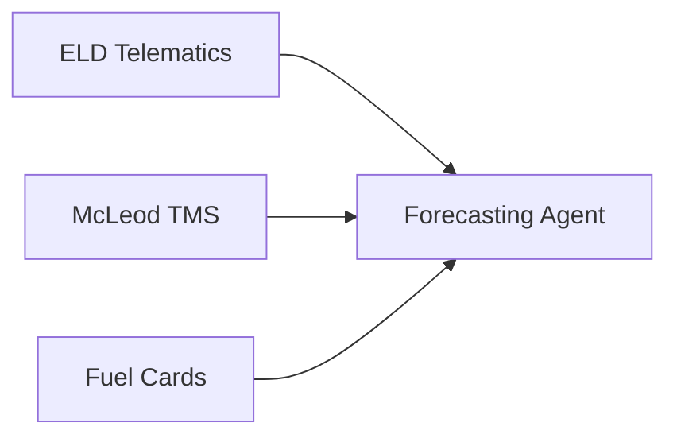

# Landstar System Integration

## Data Sources

## API Endpoints
| Service | Endpoint | Sample Use |
|---------|----------|------------|
| Capacity | `/v1/capacity/forecast` | Driver allocation |
| Pricing | `/v1/pricing/spot` | Bid guidance |
| Routing | `/v1/routing/optimize` | Load planning |
