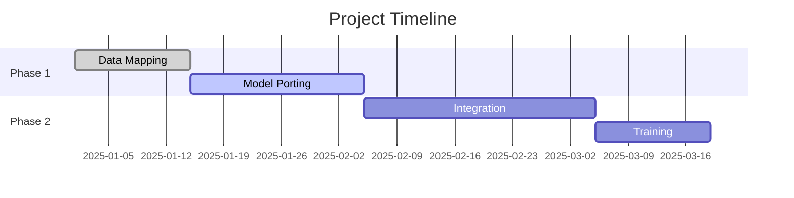

# Client Onboarding Process

## Implementation Timeline

## Team Requirements
| Role | FTE | Duration |
|------|-----|----------|
| Data Engineer | 0.5 | 8 weeks |
| ML Engineer | 1.0 | 12 weeks |
| DevOps | 0.2 | Ongoing |
