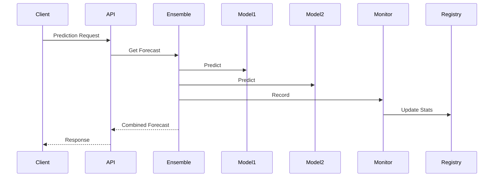

# Prediction Pipeline Architecture

## Sequence Diagram


## Error Handling
1. Model Failure: Skip and rebalance weights
2. Timeout: Return partial results
3. Data Issues: Fallback to last known good

## Performance Critical Path
```python
def predict_flow():
    start = time.time()
    preprocess()  # 5ms
    model_predict()  # 45ms
    monitor()  # 2ms
    return time.time() - start
```
